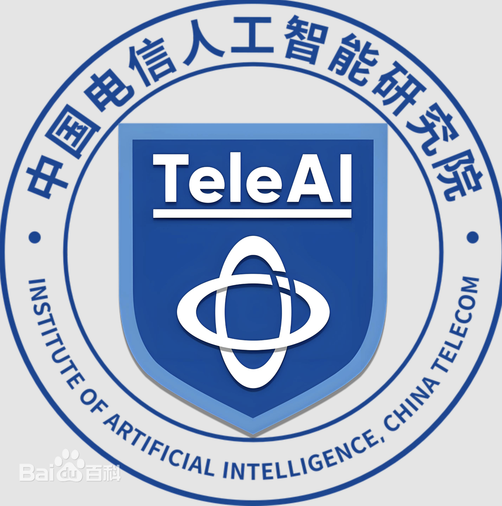
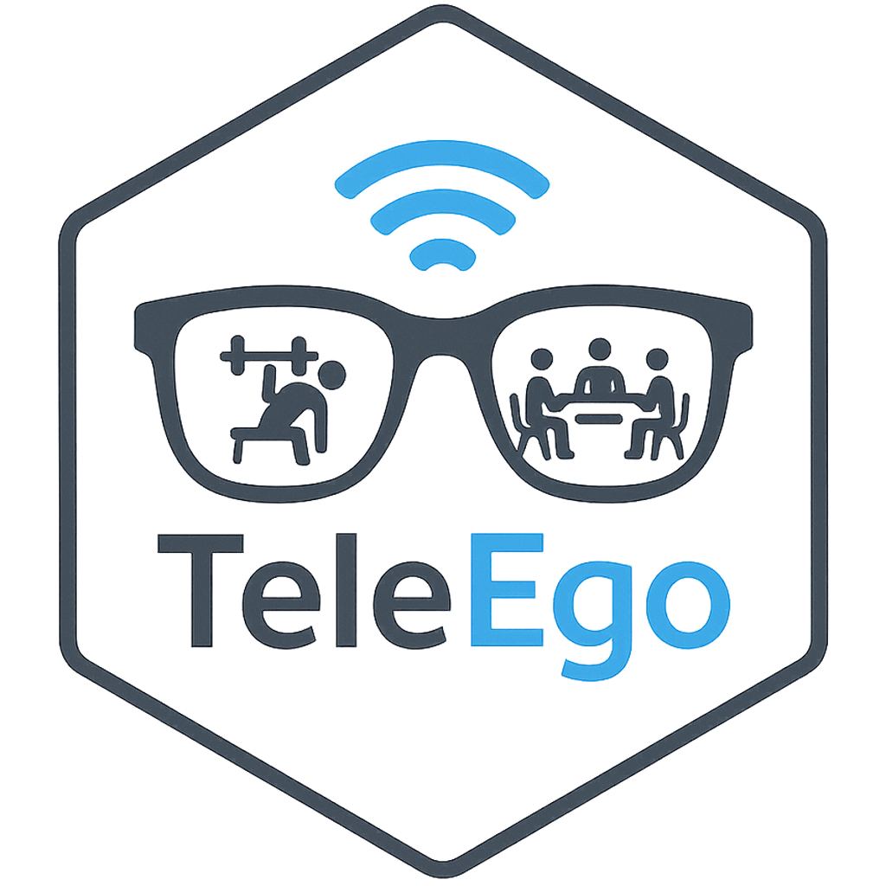
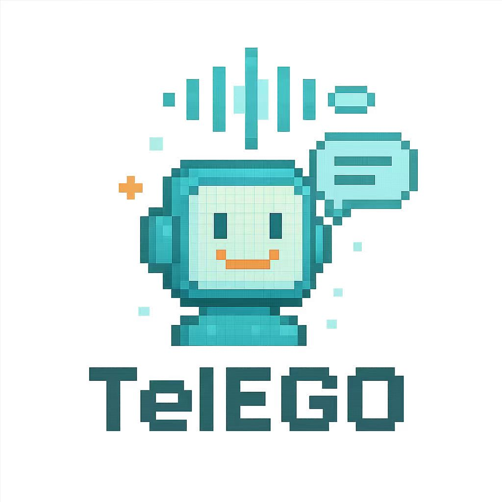

<div align="center">
  <h1>Code and data for TeleEgo</h1>
</div>
<p align="center">
    </br>
    <div align="center">
      
      
      
    </div>
    </br>
    <div align="center">
        <a href="https://www.python.org/">
            
        </a>
        <a>
            
        </a>
    </div>
</p>

# Introduction

**TeleEgo** is the first comprehensive **omni benchmark** designed for **multi-person, multi-scene, multi-task, and multimodal long-term memory reasoning** in egocentric video streams.
It reflects realistic personal assistant scenarios where continuous first-person video data is collected across hours or even days, requiring models to maintain and reason over **episodic memory, contextual understanding, and cross-memory reasoning**. **Omni** here means that TeleEgo covers the full spectrum of **participants, scenes, tasks, modalities, and memory horizons**, offering all-round evaluation for embodied AI assistants.

TeleEgo provides:

* **Omni-scale, rich, diverse egocentric data** collected from 5 participants across 3 daily scenarios (work/study, social interaction, shopping, health, and travel).
* **Multi-modal annotations**, including first-person video, narration, and speech transcripts.
* **A fine-grained QA benchmark** with 3 cognitive dimensions and 11 subcategories, covering short-term/long-term/ultra-long memory, entity tracking, causal reasoning, intent inference, cross-event reasoning, and more.

---

## Dataset Overview

* **Participants**: 5 (balanced gender, diverse cultural backgrounds)
* **Scenarios**:

  * Work & Study
  * Social Activities
  * Shopping
  * Health Management
  * Travel & Exploration
* **Recording**: 3 days per participant, \~15 hours total per participant
* **Modalities**:

  * Egocentric video streams
  * Speech & conversations
  * Narration and event descriptions

---

## Benchmark Tasks

TeleEgo-QA evaluates models along **three main dimensions**:

1. **Episodic Memory Modeling**

   * Short-term Memory
   * Long-term Memory
   * Ultra-long Memory
   * Entity Tracking
   * Temporal Comparison & Interval

2. **Contextual & Intentional Comprehension**

   * Causal Understanding
   * Intent Inference
   * Multi-step Reasoning
   * Cross-modal Understanding

3. **Cross-Memory Reasoning**

   * Cross-temporal Causality
   * Cross-entity Relation
   * Temporal Chain Understanding

Each QA instance is labeled with:

* **Difficulty level** (Easy, Medium, Hard)
* **Question type** (Single-choice, Multiple-choice, True/False, Open-ended)

---

## Key Advantages over Existing Benchmarks

* **Compared with EgoLife**: TeleEgo offers **omni-scenario coverage** (not restricted to a single shared environment), broader task diversity, fine-grained memory categories, multi-task trajectories, and difficulty levels.
* **Compared with M3-Agent / HourVideo**: TeleEgo is explicitly **omni-task and omni-modal**, focusing on **diagnostic memory evaluation**, cross-event reasoning, and multimodal grounding in **real-life egocentric settings**.

---

## Repository Structure

```
TeleEgo/
│
├── data/                 # Dataset samples / metadata (link provided separately)
├── tasks/                # Benchmark task definitions
├── evaluation/           # Evaluation scripts
├── baseline_models/      # Example model scripts
├── docs/                 # Documentation and detailed reports
└── README.md             # This file
```

---

## Installation

```bash
git clone https://github.com/<your-org>/TeleEgo.git
cd TeleEgo
pip install -r requirements.txt
```

---

## Usage

### Dataset Access

Due to privacy and licensing constraints, please request dataset access here:
👉 [Dataset Access Form](https://your-dataset-link)

### Running Evaluation

```bash
python evaluation/run_eval.py --model <model_name> --data_path <path_to_data>
```

### Example

```bash
python evaluation/run_eval.py --model baseline_vlm --data_path ./data/sample
```

---

## Baselines

---

## 🤝 Collaborators

Thanks to these amazing people for contributing to the project:

<a href="https://github.com/rebeccaeexu">
  
</a>
<a href="https://github.com/DavisWANG0">
  
</a>
<a href="https://github.com/H-oliday">
  
</a>
<a href="https://github.com/Xiaolong-RRL">
  
</a>
<a href="https://github.com/Programmergg">
  
</a>
<a href="https://github.com/cocowy1">
  
</a>
<a href="https://github.com/chxy95">
  
</a>


## Citation

If you use **TeleEgo** in your research, please cite:

```bibtex
@article{teleego2025,
  title   = {TeleEgo},
  author  = {Your Team Names},
  journal = {arXiv preprint arXiv:xxxx.xxxxx},
  year    = {2025}
}
```

---

## License

This project is licensed under the **MIT License**.
Dataset usage is restricted under a **research-only license**.

---

## References

* EgoLife: Towards Egocentric Life Assistant [\[arXiv:2503.03803\]](https://arxiv.org/abs/2503.03803)
* M3-Agent: Seeing, Listening, Remembering, and Reasoning [\[arXiv:2508.09736\]](https://arxiv.org/abs/2508.09736)
* HourVideo: 1-Hour Video-Language Understanding [\[arXiv:2411.04998\]](https://arxiv.org/abs/2411.04998)

---

✨ **TeleEgo is an Omni benchmark, a step toward building AI assistants with true long-term memory and memory reasoning in real-world wearable scenarios.**

---
